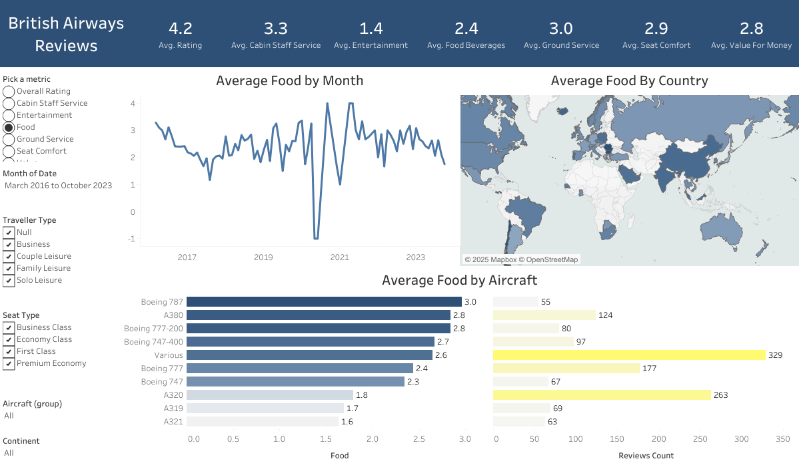

# 
✈️ British Airways Reviews Dashboard

  

An interactive Tableau dashboard analyzing customer sentiment and review trends for **British Airways**.  
This project leverages real customer feedback data to identify service patterns, satisfaction levels, and areas for improvement.

---

## 
🌐 View the Live Dashboard

👉 <a href="https://public.tableau.com/app/profile/al.john.compendio/viz/BritishAirwaysReviews_17590476094870/Dashboard1"><b>View on Tableau Public</b></a>

---

## 
📊 Project Overview

- Analyzed airline reviews to uncover insights into customer satisfaction and pain points.  
- Explored review data by **country**, **rating**, **travel type**, and **seat class**.  
- Highlighted sentiment trends across flight experience, cabin service, and overall recommendation scores.  
- Created a Tableau dashboard to visualize and communicate findings effectively.

---

## 
🧰 Tools & Technologies

- **Tableau Public** — for interactive data visualization  
- **Excel / Google Sheets** — for initial data preparation  
- **Python / pandas (optional)** — for additional data cleaning  
- **CSV files** — as the data source for Tableau

---

## 
📂 Files in This Repository

| File | Description |
|------|--------------|
| `ba_reviews.csv` | Main dataset containing British Airways customer reviews |
| `Countries.csv` | Supplementary dataset for mapping country data |
| `British Airways Reviews_v2025.1.twbx` | Packaged Tableau workbook file for local use |
| `README.md` | Project overview and documentation |

---

## 
📈 Key Insights

- **Higher satisfaction** among business-class and premium travelers.  
- **Economy class** passengers reported more mixed experiences.  
- **Service and staff friendliness** were recurring themes in positive reviews.  
- Insights can help British Airways target improvements in specific routes or service categories.

---

## 
🏁 How to Use

1. Download the datasets from this repository.  
2. Open the Tableau workbook (`.twbx`) or recreate the dashboard using the provided data.  
3. For interactive exploration, use the [Tableau Public link](https://public.tableau.com/app/profile/al.john.compendio/viz/BritishAirwaysReviews_17590476094870/Dashboard1).

---

💡 *Created by Al John Compendio — 2025*

